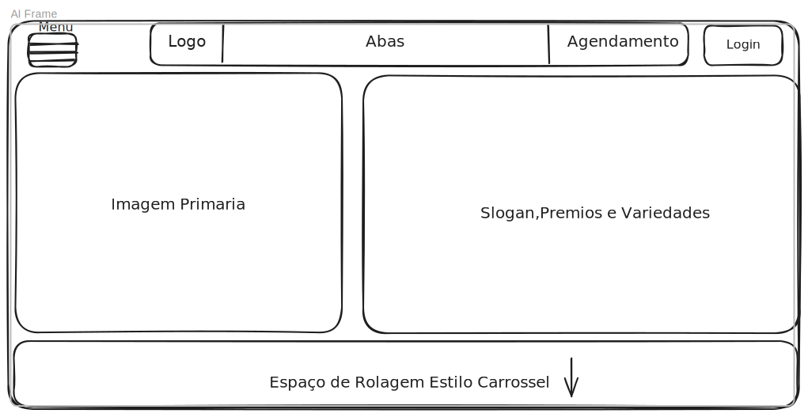

# Sistema-Barbearia
Protejo de sistema Web desenvolvido no curso de programador web do senac

 Briefing - Barbearia Garb’s
### 1. Informações Gerais
- Nome do Negócio: Garb’s Barbearia

- Segmento: Beleza Masculina / Serviços de Barbearia

- Localização: [Sobral/Ce]

### 2. Missão
- Oferecer cortes de cabelo, barbas e cuidados masculinos com excelência, estilo e atenção ao cliente, em um ambiente acolhedor e moderno.

### 3. Visão
- Ser reconhecida como a barbearia de referência em estilo, atendimento e inovação na região.

### 4. Valores
- Estilo e autenticidade

- Atendimento humanizado

- Comprometimento com a qualidade

- Respeito à tradição e abertura à inovação

- Higiene e segurança

### 5. Público-Alvo

- Estilo de vida: Jovens adultos e adultos modernos, preocupados com aparência, que valorizam o autocuidado e o estilo pessoal.

- Ocupações: Estudantes, profissionais liberais, empresários, influenciadores, trabalhadores urbanos.

- Comportamento: Buscam praticidade, agilidade no atendimento e um ambiente agradável.

### 6. Serviços Oferecidos
- Corte Tradicional e Moderno

- Barba (com toalha quente e barboterapia)

- Sobrancelha

- Hidratação Capilar

- Pigmentação de Barba

- Relaxamento ou Alisamento Capilar

- Design de Corte com Navalha

- Pacotes “Corte + Barba”

- Corte Infantil

### 7. Produtos Relacionados (à venda na barbearia ou online)
- Pomadas e ceras modeladoras

- Shampoos e condicionadores masculinos

- Óleos para barba

- Kits de barbear (navalha, pincel, espuma, loções)

### 8. Concorrência Direta e Indireta
- Outras barbearias do bairro ou cidade com proposta moderna

- Salões de beleza unissex

### 9. Diferenciais da Garb’s
- Atendimento com hora marcada e pontualidade

- Ambiente estilizado com música ambiente, café ou cerveja 

- Profissionais treinados e atualizados nas tendências

- Venda de produtos profissionais exclusivos

- Fidelização de clientes com programas de pontos ou descontos

### 10. Canais de Comunicação
- Presenciais: Fachada, ambientação

#### Digitais:

- Site institucional com agendamento online

- Instagram com fotos de cortes e bastidores

Google Meu Negócio para avaliações e localização

### 11. Objetivos do Site / Projeto Digital
Apresentar a barbearia e seus diferenciais

- Exibir serviços e preços

- Mostrar portfólio (fotos antes/depois)

- Vender produtos online (futuramente)

- Permitir agendamento via WhatsApp ou sistema

- Coletar contatos e mensagens pelo formulário

- Criar presença profissional na internet

### 12. Paleta de Cores e Estilo Visual (sugestão)
Preto, cinza escuro e dourado (luxo e masculinidade)

- Tipografia robusta com serifa ou estilo vintage

- Elementos gráficos como navalhas, bigodes, tesouras

- Inspiração retrô/industrial (cimento queimado, madeira, metais)

## Equipe
- Bruno -  https://github.com/B-Ghostt
- Fernanda - https://github.com/fernandaduarten
- João Victor - https://github.com/EscuroStout1
- Lucas Silva - https://github.com/Lucas-silva11
- Tayna - https://github.com/TayCVeras
- Pietro - https://github.com/PietroArcanjo
